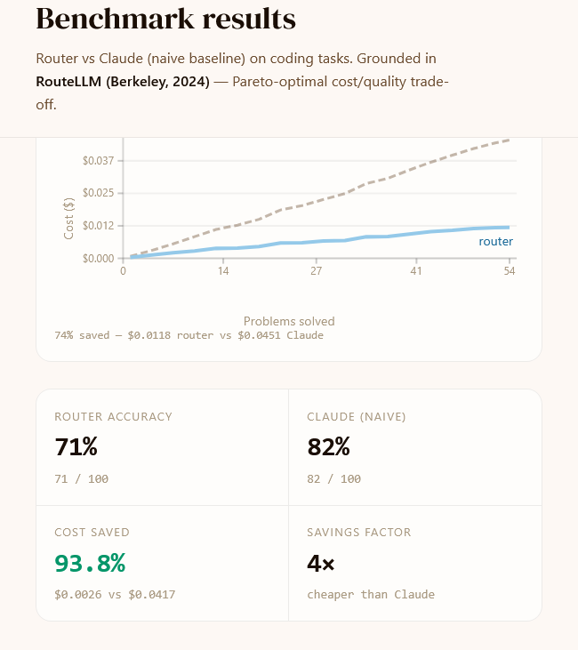
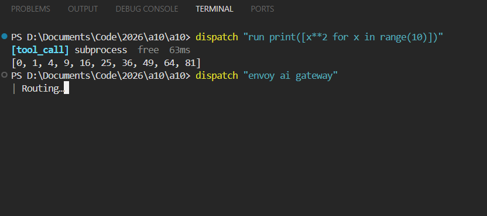

# Dispatch

**Winner — Best Customer Usability, A10 Networks Hackathon 2025**

Dispatch is a cost-aware LLM router built solo over a single weekend. It classifies incoming queries and dynamically routes them to the most cost-effective model capable of handling the request across four lanes: **memory**, **fast**, **medium**, and **strong**.

The routing core is based on Berkeley's 2024 [RouteLLM paper](https://arxiv.org/abs/2406.18665). The memory lane is built on Andrej Karpathy's local wiki idea — a folder of small, narrowly-scoped markdown files with an index, searched on demand via BM25 so only the relevant pages enter the context window. The classifier is a fine-tuned Qwen 1.5B Instruct (PEFT + LoRA). The fast lane uses a Llama 3.1 8B fine-tuned on Glaive Function Calling v2 for tool use.

On HumanEval, Dispatch scores **71% pass@1** vs Claude Sonnet 4.6's **82%** — roughly 87% of Sonnet's accuracy at **74% lower cost**.



There's also a CLI (`dispatch`) you can use like Claude Code — pipe files or questions in from the terminal and they get routed the same way.



Ships with a Flask backend, a React/Vite frontend, the `dispatch` CLI, and evaluation harnesses for MMLU and HumanEval.

## Repository Layout

```
project/
├── backend/       Flask API, router, memory, tools, OpenRouter client
├── frontend/      React + Vite + Tailwind UI
├── training/      Qwen classifier fine-tuning + FastAPI serving
├── scripts/       Eval runners (MMLU, HumanEval)
├── tests/         pytest suite
├── data/          mmlu_100.csv
├── cli.py         `dispatch` CLI entry point
├── pyproject.toml CLI install metadata
└── requirements.txt   Backend runtime deps
Wiki/              Structured memory + project docs
Clippings/         Raw source material for wiki
```

## Prerequisites

| Tool | Version | Notes |
|------|---------|-------|
| Python | 3.10+ | `pyproject.toml` requires `>=3.10` |
| Node.js | 20+ | Vite 8 requires modern Node |
| npm | 10+ | Comes with Node |
| OpenRouter API key | — | Required unless everything goes through the local model |
| CUDA 12.1 + GPU | optional | Only needed to train/serve the classifier locally |

## 1. Clone and Enter

```bash
git clone <repo-url> a10
cd a10/project
```

All commands below assume you are inside `project/` unless stated otherwise.

## 2. Backend Setup

### 2.1 Create a virtualenv and install deps

```bash
python -m venv .venv
# Windows
.venv\Scripts\activate
# macOS / Linux
source .venv/bin/activate

pip install --upgrade pip
pip install -r requirements.txt
pip install rank-bm25   # used by the CLI for wiki BM25 search
```

### 2.2 Configure environment variables

Create `project/backend/.env` (auto-loaded by `python-dotenv`):

```ini
# Required — unless you only use the local cheap model
OPENROUTER_API_KEY=sk-or-v1-...

# Optional — local vLLM / OpenAI-compatible endpoint for the "cheap_model" branch
# e.g. CHEAP_MODEL_URL=http://localhost:8000/v1
CHEAP_MODEL_URL=

# Optional — URL of a running classifier server (see training/serve.py)
CLASSIFIER_URL=
```

Reference:

| Variable | Required | Purpose |
|----------|----------|---------|
| `OPENROUTER_API_KEY` | Yes (for OpenRouter models) | Auth for OpenRouter chat completions |
| `CHEAP_MODEL_URL` | No | OpenAI-compatible URL for the locally served Llama-8B |
| `CLASSIFIER_URL` | No | FastAPI classifier base URL; falls back to rules if unset |
| `ROUTER_BACKEND` | CLI only | Base URL of the running Flask backend (used by `dispatch`) |
| `ROUTER_WIKI_PATH` | CLI only | Override wiki root for BM25 search (default: repo `Wiki/`) |

### 2.3 Run the backend

```bash
cd backend
python app.py
# → http://localhost:5000
```

Key endpoints:

| Method | Path | Purpose |
|--------|------|---------|
| POST | `/api/route` | Route + call model, return JSON |
| POST | `/api/route/stream` | SSE stream with meta / token / tool_use / done events |
| GET  | `/api/eval/summary` | MMLU summary (needs `eval_results.json`) |
| GET  | `/api/eval/humaneval` | HumanEval pass@1 + cost |
| GET  | `/api/eval/pareto` / `/pgr` / `/confusion` / `/branch_accuracy` / `/cost_breakdown` / `/savings_curve` | Chart data |
| GET  | `/api/health` | Liveness probe |

## 3. Frontend Setup

```bash
cd project/frontend
npm install
npm run dev
# → http://localhost:5173
```

Frontend scripts:

| Command | Description |
|---------|-------------|
| `npm run dev` | Vite dev server with HMR |
| `npm run build` | `tsc -b && vite build` — production build into `dist/` |
| `npm run preview` | Serve the built bundle locally |
| `npm run lint` | Run ESLint |

The dev server talks to `http://localhost:5000` by default. If you expose the backend via ngrok or a different port, update the base URL wherever the frontend fetches (`src/`).

## 4. Run Evaluations

Both scripts write JSON into `backend/` so the eval endpoints can read them.

```bash
# From project/ with venv active
python scripts/run_eval.py           # MMLU → backend/eval_results.json
python scripts/run_humaneval.py      # HumanEval → backend/humaneval_results.json

# Optional: use the fine-tuned classifier instead of the rules classifier
CLASSIFIER_URL=http://localhost:8001 python scripts/run_eval.py
```

## 5. CLI (`dispatch`)

Install the CLI into your active Python env:

```bash
cd project
pip install -e .
```

Usage:

```bash
export ROUTER_BACKEND=http://localhost:5000

dispatch "what is BM25 used for?"
dispatch -f backend/router.py "explain what this file does"
echo "write a binary search in python" | dispatch
dispatch "run print(sum(range(10)))"   # executes code locally, no model call
```

## 6. Tests

```bash
cd project
pytest               # runs tests/ (router contract + humaneval runner)
```

## 7. Optional: Classifier Training & Serving

The classifier lives in `project/training/` and uses **two separate environments** (training vs serving) because their binary stacks are incompatible. See `project/training/ENVIRONMENTS.md` for rationale.

### 7.1 Training

```bash
cd project/training
python -m venv .venv-train
source .venv-train/bin/activate      # Windows: .venv-train\Scripts\activate
pip install --upgrade pip
pip install torch==2.3.1 --index-url https://download.pytorch.org/whl/cu121
pip install -r requirements-train.txt

python prepare_dataset.py
python train.py
```

### 7.2 Serving

```bash
cd project/training
python -m venv .venv-serve
source .venv-serve/bin/activate
pip install --upgrade pip
pip install torch --index-url https://download.pytorch.org/whl/cu121
pip install -r requirements-serve.txt

python serve.py --port 8001
# → POST http://localhost:8001/classify
```

Then point the backend at it:

```bash
export CLASSIFIER_URL=http://localhost:8001
```

## 8. Typical Local Dev Loop

In three terminals from the repo root:

```bash
# Terminal 1 — backend
cd project/backend && python app.py

# Terminal 2 — frontend
cd project/frontend && npm run dev

# Terminal 3 — CLI or eval runs
cd project
export ROUTER_BACKEND=http://localhost:5000
dispatch "what is the capital of france"
```

Open `http://localhost:5173` to use the UI.

## 9. Troubleshooting

| Symptom | Likely cause | Fix |
|---------|--------------|-----|
| `OPENROUTER_API_KEY` errors / 401 | Missing or stale key | Set `OPENROUTER_API_KEY` in `backend/.env` |
| `eval_results.json not found` | Eval never ran | `python scripts/run_eval.py` |
| `humaneval_results.json not found` | HumanEval never ran | `python scripts/run_humaneval.py` |
| CLI prints `ROUTER_BACKEND not set` | Env var missing | `export ROUTER_BACKEND=http://localhost:5000` |
| `rank_bm25` import warning from CLI | Optional dep missing | `pip install rank-bm25` |
| Vite build fails on Node <20 | Vite 8 requires Node 20+ | Upgrade Node |
| Frontend cannot reach backend | CORS / wrong port | Confirm Flask is on `5000` and `flask-cors` is installed |

## 10. Security Notes

- Never commit `.env`. `OPENROUTER_API_KEY` is a live secret.
- The `execute_python` tool runs code in a subprocess with a 5s timeout. Do not expose the backend publicly without additional sandboxing.
- `fetch_url` performs outbound HTTP with an 8s timeout. Treat it as an SSRF surface if deployed.
